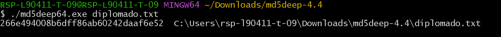
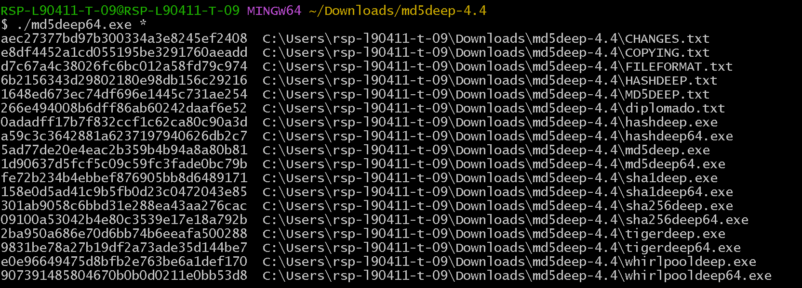
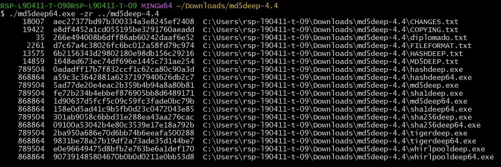

# M5DEEP

## M5Deep es una serie de programas para calcular algoritmos de HASH como lo son MD5, SHA-1, SHA-256, Tiger, o Whirlpool

## Sus principales características son

* Operación recursiva 
* Modo de comparación
* Estimación de tiempo de calculo
* Piecewise hashing
* Modo de tipos de archivos

## Ejemplos

### Generación de hash de un solo fichero

### Generación de hash de todos los ficheros en un directorio

### Generación de hash de todos los ficheros en un directorio con tamaño del archivos

